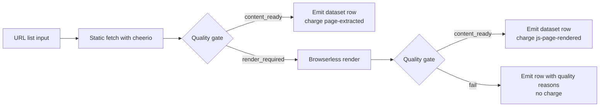

# JS Content Crawler Lite for RAG

Static-first web content extraction with on-demand JS rendering, built for RAG pipelines.

[](https://apify.com/george.the.developer/js-content-crawler-lite-rag?fpr=bbquoh)

## Why this actor

RAG ingestion lists are messy. Half the URLs are plain HTML news pages or docs that a static fetcher handles in under a second. The other half are SPAs, marketing pages with framework-rendered content, or Cloudflare-gated targets that need a real browser. Most crawlers force you to pick one mode for the whole batch, so you either pay browser cost on every URL or skip the SPAs entirely.

This actor splits the cost. Every URL hits a cheap static lane first. A quality gate decides if the result is real content or a render-required stub. Only the stubs get escalated to a headless Chromium render via Browserless. You pay browser prices on the URLs that actually need a browser.

## Pricing

Pay per event. Activates 2026-05-29 after the standard Apify hold.

| Event | Price | When charged |
|---|---:|---|
| `page-extracted` | $0.005 | Per URL fetched on the static lane and gated as content_ready |
| `js-page-rendered` | $0.015 | Per URL escalated to Browserless and gated as content_ready |

URLs that fail the quality gate on both lanes are not charged. Health probes and known test payloads short-circuit and are not charged.

The split matters. A 10,000 URL ingest where 80 percent are static averages out to roughly $0.007 per URL instead of $0.015 flat. The bigger the static share, the bigger the savings.

## Architecture



The static lane uses got + cheerio. The render lane uses a remote Browserless instance via HTTPS proxy. Both lanes share one quality gate so the schema stays consistent regardless of source.

## Output schema

Every dataset row carries 17 fields.

| Field | Description |
|---|---|
| `url` | Input URL, post normalization |
| `title` | Page title from og:title, twitter:title, or `<title>` |
| `description` | Meta description or og:description |
| `markdown` | Main content as markdown, headings preserved |
| `text` | Plaintext version of the markdown |
| `wordCount` | Count of whitespace separated tokens in text |
| `headings` | Array of `{level, text}` for h1 to h4 |
| `links` | Array of outbound link URLs found in main content |
| `images` | Array of `{src, alt}` for content images |
| `sourceLane` | `static` or `browserless` |
| `rendered` | `true` if the page was rendered by Browserless |
| `qualityState` | `content_ready`, `render_required`, `render_unavailable`, or `failed` |
| `qualityReasons` | Array of reasons the gate decided as it did |
| `billingState` | `billable` or `unbilled` |
| `chargedEvent` | `page-extracted`, `js-page-rendered`, or null |
| `statusCode` | HTTP status code of the final response |
| `fetchedAt` | ISO timestamp when the row was finalized |

## Use cases

**RAG ingestion.** Feed a list of source URLs into the actor, get clean markdown rows, embed them. The markdown field is structured for chunking by heading so retrieval keeps semantic coherence.

**Embedding databases.** Bulk seed Pinecone, Weaviate, Chroma, or pgvector with web content. Word count and quality flags let you filter low-signal pages before paying for embeddings.

**AI agent web tools.** Wire the actor into an agent's web-read tool. The static-first split keeps tool calls cheap on simple pages and the render fallback handles SPAs without code branches in the agent.

**LLM fine-tuning data prep.** Pull a domain corpus, filter by quality state and word count, ship the markdown into your training data pipeline. The deterministic schema makes it easy to dedupe and audit.

**Content monitoring.** Schedule the actor against a watchlist. Diff the markdown field across runs to surface meaningful changes without diffing raw HTML noise.

**Internal search index seeding.** Crawl your own docs and marketing site, index the markdown into Meilisearch or Typesense, get search that respects heading structure instead of div soup.

## Quick start

cURL against the run endpoint:

```bash
curl -X POST "https://api.apify.com/v2/acts/george.the.developer~js-content-crawler-lite-rag/runs?token=YOUR_APIFY_TOKEN" \
  -H "Content-Type: application/json" \
  -d '{
    "startUrls": [{"url": "https://example.com"}],
    "renderMode": "auto"
  }'
```

Node.js with apify-client:

```js
import { ApifyClient } from 'apify-client';

const client = new ApifyClient({ token: process.env.APIFY_TOKEN });

const run = await client.actor('george.the.developer/js-content-crawler-lite-rag').call({
  startUrls: [{ url: 'https://example.com' }],
  renderMode: 'auto',
});

const { items } = await client.dataset(run.defaultDatasetId).listItems();
console.log(items[0].markdown);
```

Python with apify-client:

```python
from apify_client import ApifyClient

client = ApifyClient(token="YOUR_APIFY_TOKEN")

run = client.actor("george.the.developer/js-content-crawler-lite-rag").call(run_input={
    "startUrls": [{"url": "https://example.com"}],
    "renderMode": "auto",
})

for row in client.dataset(run["defaultDatasetId"]).iterate_items():
    print(row["markdown"])
```

## Verified performance

Live runs on the Apify cloud against example.com, 2026-05-15.

| Lane | Wall time | Quality state | Charged event |
|---|---:|---|---|
| Static (`renderMode=never`) | 4.3s | content_ready | page-extracted |
| Browserless (`renderMode=always`) | 5.0s | content_ready | js-page-rendered |

Both runs returned 18 words extracted on first try with no retries. The render lane is only 0.7s slower than static for cold-cache rendering, which means the cost gate is the only reason to prefer one lane over the other.

## Quality gates

A row passes the gate as `content_ready` when all of these hold:

- Word count meets or exceeds the threshold (default 80, configurable per run)
- No Cloudflare turnstile or challenge markers detected in the response body
- No paywall hint phrases match (e.g. "subscribe to continue", "create a free account to read")
- No JS-required markers match (e.g. "enable JavaScript", "this site requires JavaScript", empty main with React root div)

If any of these fail on the static lane, the row is flagged `render_required` and escalated. If the render lane also fails, the row is emitted with `qualityState=failed` and `billingState=unbilled` so you keep a record without paying for it.

## Roadmap

- Per-domain rate limit so a single slow host cannot block the queue
- OG image extraction into a dedicated field with dimensions when available
- Custom CSS selector input for sites where the main content heuristic underperforms

## Links

- Apify Store: https://apify.com/george.the.developer/js-content-crawler-lite-rag?fpr=bbquoh
- Support: the.ai.entrepreneur.ai.hub@gmail.com
- Issues: https://github.com/the-ai-entrepreneur-ai-hub/js-content-crawler-lite-rag-docs/issues
